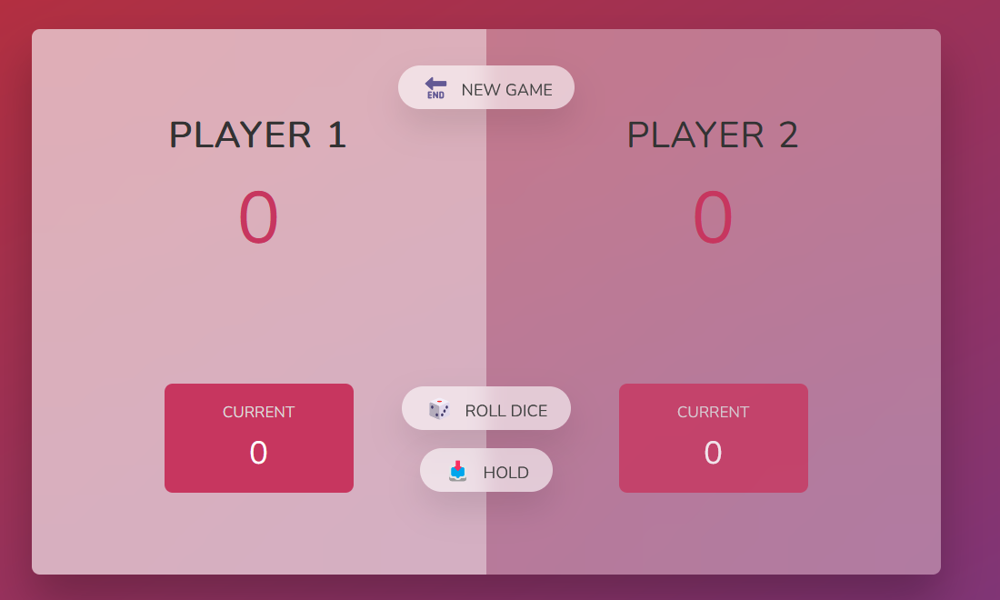

Dice Game

Overview
This is a simple two-player dice game built using HTML, CSS, and JavaScript. The game is turn-based, where players take turns rolling a dice and accumulating their scores. The first player to reach 100 points wins the game!

How to Play
1. Roll the Dice: Click the Roll Dice button to generate a random number (1-6). If you roll a 1, your turn ends, and the next player takes over.
2. Hold the Score: Click the Hold button to save your current score to your total. This will also switch the turn to the next player.
3. Winning the Game: The first player to reach 100 points wins!
4. New Game: Click the New Game button to reset the game and start over.

Game Rules
- If a player rolls a 1, they lose their accumulated round score, and their turn ends.
- Players can choose to "Hold" at any time, adding their round score to their total score and passing the turn.
- The first player to reach or exceed 100 points wins the game.

Features
- Random Dice Roll
- Turn Switching
- Win Condition
- Game Reset

Technologies Used
- HTML - Structure of the game
- CSS - Styling the UI
- JavaScript - Game logic and interactivity

Code Explanation
Initialization (init function)
The init function sets up the game by:
- Resetting player scores
- Setting activePlayer to 0
- Hiding the dice image
- Resetting UI elements

Rolling the Dice (btnRoll event listener)
- Generates a random dice roll between 1 and 6.
- If the roll is not 1, it adds to the current player's round score.
- If the roll is 1, the turn switches to the next player.

Holding the Score (btnHold event listener)
- Saves the current player's round score to their total score.
- Checks if the player has won (>= 100 points).
- Switches the turn to the next player.

Switching Players (switchPlayer function)
- Resets the round score.
- Changes the active player.
- Toggles the active player indicator.

Restarting the Game (btnNew event listener)
- Calls init to reset everything and start fresh.

How to Run the Game
1. Clone this repository or copy the code into an HTML file.
2. Ensure you have an images/ folder containing dice images (dice-1.png to dice-6.png).
3. Open the HTML file in your browser and start playing!

Future Enhancements
- Improve UI/UX with animations.
- Add sound effects.
- Customize winning conditions.

Enjoy the game and have fun rolling the dice!

